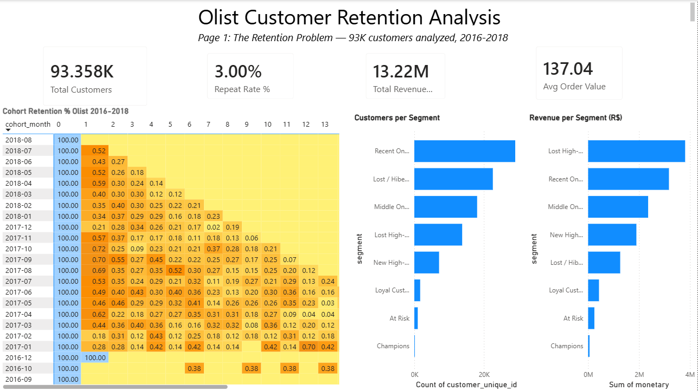
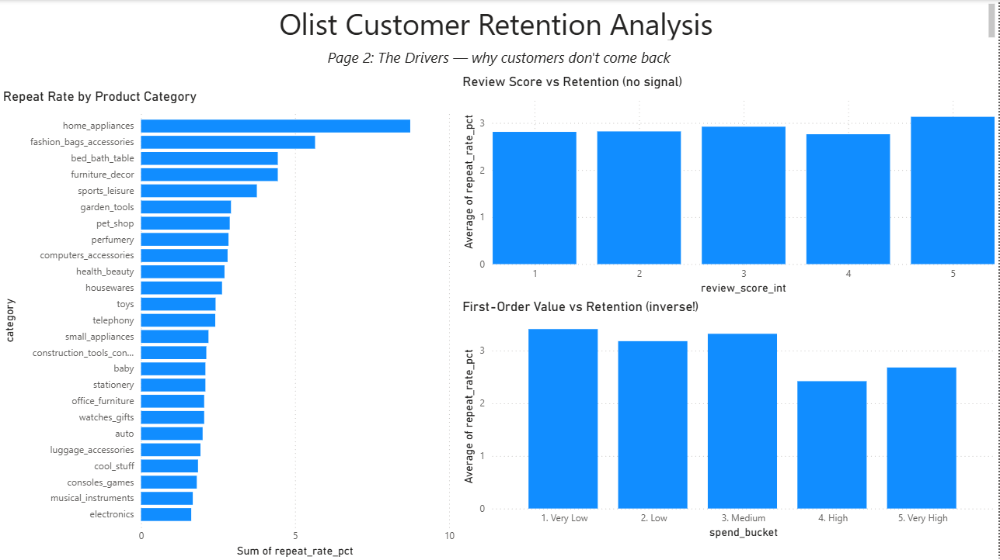

# Olist Customer Retention Analysis

End-to-end analysis of customer retention at **Olist**, a Brazilian e-commerce marketplace, covering ~100K customers and R$ 13M in revenue from 2016-2018. The project combines Python, PostgreSQL, and Power BI to diagnose why customers don't return and identify where retention investment would actually move the needle.

## The headline finding

> **70.6% of Olist's revenue comes from customers who bought exactly once.** The single largest revenue segment is *Lost High-Value customers* — 13,646 people who spent R$ 3.8M (28.7% of total revenue) and never came back. Olist's retention problem is hiding inside its biggest revenue source.

---

## Dashboard

**Page 1 — The Retention Problem**



**Page 2 — The Drivers**



---

## Key findings

**1. Only 3.00% of customers ever place a second order.** Industry benchmark is 20-40%. This is a structural retention failure, not a bad-quarter problem.

**2. The retention "cliff" is nearly vertical.** Across every monthly cohort from 2017-2018, retention drops from 100% in month 0 to ~0.48% in month 1 — then stays flat. Customers aren't churning slowly; they're vanishing after the first purchase.

**3. Two common retention levers don't work at Olist.**
- Delivery speed: repeat and one-time customers had statistically identical median delivery times (~10 days). Faster shipping would not move retention.
- Review score: 5-star reviewers repeat at 3.08%, 1-star reviewers repeat at 2.72%. A 0.36 percentage point difference is not a lever.

**4. Product category is the strongest signal.** Home appliances retain at 8.74% (5.3x higher than electronics at 1.66%). Counterintuitively, "durable" home categories produce more repeat customers than "gadget" categories — suggesting Olist's stickiness comes from home-goods browsing behavior, not electronics price-comparison shopping.

**5. First-order value is *inversely* correlated with retention.** Customers spending under R$ 35 on their first order repeat at 3.38%; customers spending over R$ 159 repeat at 2.64%. Bigger first purchases ≠ better customers. This contradicts standard e-commerce assumptions.

---

## Recommendations

1. **Prioritize a win-back campaign for Lost High-Value customers (13,646 people, R$ 3.8M revenue).** These customers have already proven willingness to pay — they are the highest-ROI retention segment.
2. **Nurture New High-Value customers (7,121 recent big spenders) before they churn.** Intercept them now rather than trying to reactivate them later.
3. **Do not invest in faster shipping or customer-service improvements to fix retention.** The data does not support either as a driver.
4. **Rebalance category acquisition toward home goods.** Home appliances, furniture, bed/bath, and sports/leisure all out-retain the platform average.
5. **Fix Olist's `customer_id` infrastructure.** The system generates a new ID per order, which means the business cannot identify its own loyal customers. The most loyal customer (17 orders) currently appears as 17 different people in the database.

---

## Project structure
olist-retention-analysis/
├── data/
│   ├── raw/                # Original Kaggle CSVs (not in repo — see data source below)
│   └── processed/          # Cleaned and enriched data
├── notebooks/
│   ├── 01_data_exploration.ipynb      # Schema mapping, data quality checks
│   ├── 02_cohort_analysis.ipynb       # Cohort retention + RFM segmentation
│   └── 03_retention_drivers.ipynb     # 4-hypothesis driver analysis
├── sql/
│   ├── schema.sql                     # CREATE TABLE statements for all 9 tables
│   └── analysis_queries.sql           # 4 portable SQL queries reproducing key findings
├── dashboard/
│   └── olist_retention_dashboard.pbix # Power BI dashboard (2 pages)
├── reports/                           # Exported charts and dashboard screenshots
└── README.md
---

## Tech stack

| Layer | Tool | Role |
|---|---|---|
| Database | PostgreSQL 17 | Source of truth, ran 5 analytical views |
| Analysis | Python 3.10 (pandas, numpy, matplotlib, seaborn) | Data cleaning, statistical analysis, charts |
| SQL | PostgreSQL (CTEs, window functions, NTILE, ROW_NUMBER) | Reproduced findings in pure SQL for validation |
| Visualization | Power BI Desktop | 2-page executive dashboard, live-connected to PostgreSQL |
| Version control | Git + GitHub | Source control |

---

## How to reproduce

**Prerequisites:** Python 3.10+, PostgreSQL 17+, Power BI Desktop (Windows), Git.

**1. Clone this repo.**
```bash
git clone https://github.com/YOUR-USERNAME/olist-retention-analysis.git
cd olist-retention-analysis
```

**2. Download the dataset.** The raw CSVs are not included (~130MB).
- Kaggle: [Brazilian E-Commerce Public Dataset by Olist](https://www.kaggle.com/datasets/olistbr/brazilian-ecommerce)
- Extract all 9 CSVs into `data/raw/`

**3. Set up the database.**
```sql
-- In pgAdmin or psql
CREATE DATABASE olist_retention;
-- Then run sql/schema.sql to create the 9 tables
-- Then import each CSV into its matching table
```

**4. Install Python dependencies.**
```bash
pip install pandas numpy matplotlib seaborn jupyter pyarrow
```

**5. Run the notebooks in order** (01 → 02 → 03).

**6. Open the Power BI dashboard.**
- Open `dashboard/olist_retention_dashboard.pbix`
- When prompted for credentials, connect to your local `olist_retention` database

---

## Methodology notes

**The critical data-quality finding:** Olist's `customer_id` column is misleadingly named — it is generated per order, not per person. The true customer identifier is `customer_unique_id`. Using `customer_id` would report 0% repeat purchase rate across the entire dataset. Every analysis in this project uses `customer_unique_id`.

**Analysis universe:** All analyses are filtered to `order_status = 'delivered'` only (110,197 of 113,425 order items). Cancelled, unavailable, and in-progress orders are excluded because they don't represent real customer transactions.

**Why manual buckets for frequency:** 97% of customers have frequency = 1. Standard `qcut`/`NTILE` cannot produce balanced quintiles with this skew, so frequency scores use manually-defined buckets (1 → score 1, 2 → score 3, 3-4 → score 4, 5+ → score 5).

**Why `vmax=5` in the cohort heatmap:** With month 0 always at 100%, a 0-100 color scale would wash out all meaningful variation in months 1+. Capping the gradient at 5% zooms in on the retention patterns that actually matter.

**Cross-validation:** All Python findings were independently reproduced in pure SQL (see `sql/analysis_queries.sql`) with matching results. Where small differences appear (e.g., NTILE vs qcut tie-handling), the discrepancy is under 1% and doesn't affect any conclusion.

---

## Data source

**Brazilian E-Commerce Public Dataset by Olist** — a real Olist dataset released publicly under CC BY-NC-SA 4.0. ~100K orders, ~99K customers, across 9 related tables covering orders, customers, products, sellers, payments, reviews, and geolocation, from September 2016 to October 2018.

Link: [kaggle.com/datasets/olistbr/brazilian-ecommerce](https://www.kaggle.com/datasets/olistbr/brazilian-ecommerce)

---

## Author

**Akshitha Addagatla**
Entry-level Data Analyst / Business Analyst

If you're hiring, I'd love to chat. The full analysis — from the cohort heatmap to the counterintuitive spend finding — represents how I approach unfamiliar business data: form hypotheses, let the data push back, and translate findings into recommendations someone can actually act on.